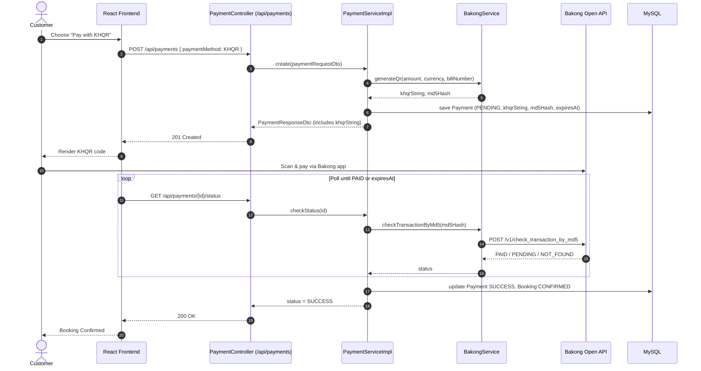

# KHQR (Bakong) Payment Integration Flow

This document describes how Bakong KHQR is integrated into the Cinema Booking System as a
second payment method alongside wallet payments, using the existing `Payment` entity and
`/api/payments` endpoint.

---

## 1. High-Level Flow

```text
Booking / Order Created
        │
        ▼
   Status: PENDING
        │
        ▼
Customer selects payment method
        │
        ▼
POST /api/payments  (paymentMethod = KHQR)
        │
        ▼
PaymentController
        │
        ▼
PaymentServiceImpl
        │
        ▼
BakongService
        ├── Build KHQR string
        └── Generate MD5 hash
        │
        ▼
Save Payment record
   Status: PENDING
   khqrString, md5Hash, expiresAt
        │
        ▼
Return QR data to React
        │
        ▼
React displays KHQR code
   (checkout / order summary page)
        │
        ▼
Customer scans & pays
   via any Bakong-linked bank app
        │
        ▼
Backend checks payment status
   Bakong: check-transaction-by-md5
        │
        ▼
   Payment found & PAID?
   ┌────────┴────────┐
   │                 │
  YES                NO
   │                 │
   ▼                 ▼
Payment: SUCCESS   Keep polling until
Booking: CONFIRMED  10-min QR expiry,
                     then Payment: FAILED
```

---

## 2. Sequence Diagram



---

## 3. Entity Changes

### `Payment` — new fields

```java
private String paymentMethod;   // "CASH" | "KHQR"
private String khqrString;      // for KHQR
private String md5Hash;       // for KHQR
private LocalDateTime expiresAt;  // for KHQR
private OrderStatus orderStatus;      // ENUM: CONFIRMED, CANCELLED,    PENDING
```

`PaymentStatus` (`PENDING`, `SUCCESS`, `FAILED`) is reused as-is — no new enum values needed.

---

## 4. New Component

### `BakongService` (new, `service/impl`)

Responsibilities:
- Build the KHQR EMV string (merchant/individual info, tags, CRC16)
- Generate the MD5 hash of the KHQR string
- Call Bakong's `check-transaction-by-md5` endpoint (production only, because in dev must be in Cambodia)
- Handle Bearer token storage/renewal for the Bakong Developer Token


Follows the same constructor-injection (`@RequiredArgsConstructor`) pattern as other services.


---

## 5. Branching Logic in `PaymentServiceImpl`

```text
create(paymentRequestDto)
        │
        ▼
   paymentMethod?
   ┌────────┴────────┐
   │                 │
 WALLET             KHQR
   │                 │
   ▼                 ▼
Check balance   bakongService.generateQr(...)
   │                 │
   ▼                 ▼
Deduct balance   Save Payment (PENDING)
   │                 │
   ▼                 ▼
Payment: SUCCESS   Return khqrString to client
Booking: CONFIRMED  (awaits confirmation via polling)
```

---

## 6. Status Confirmation Options

Two ways to move a KHQR `Payment` from `PENDING` to `SUCCESS`:

| Option | Description | Best when |
|---|---|---|
| **Client-triggered check** | `GET /api/payments/{id}/status` — React polls this endpoint every few seconds; backend calls Bakong on demand | Simpler, no background job needed |
| **Scheduled polling job** | `@Scheduled` task sweeps all `PENDING` KHQR payments and checks each MD5 until paid or expired | Better if you also want status updates without the customer's tab open |

Either way, `expiresAt` (QR validity, max 10 minutes) is the hard stop — once passed with no `PAID` result, mark the `Payment` as `FAILED`.

---

## 7. Notes / Constraints

- **Production restriction:** `check-transaction-by-md5` can only be called from servers physically located in Cambodia in production.
- **Static vs dynamic KHQR:** this flow assumes dynamic KHQR (one QR per transaction, amount baked in). Static KHQR cannot be reliably checked by MD5 and would need reconciliation against bank data instead.
- **`booking_id` nullable:** the same `Payment` record can back either a `Booking` or a standalone food/drink `Order`, consistent with the existing nullable `booking_id` design on `orders`.
- **Token lifecycle:** the Bakong Developer Token expires and must be renewed via the registered email — build this into `BakongService` rather than manually rotating tokens.
