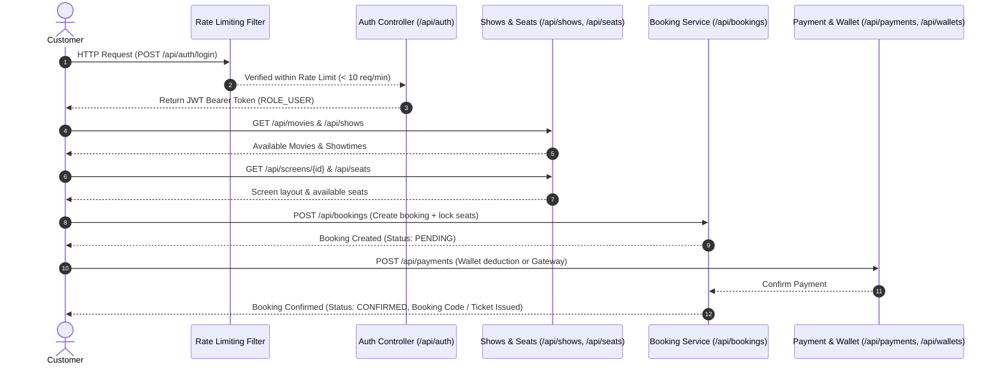
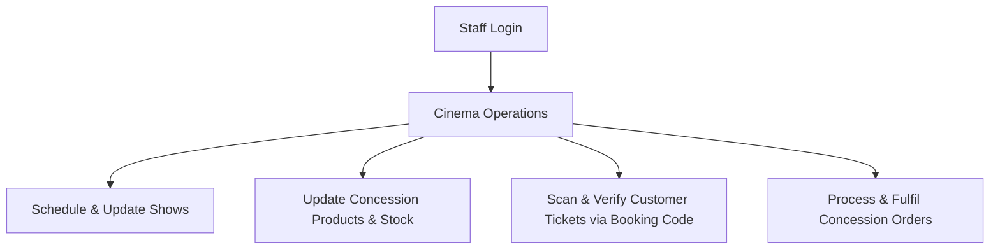
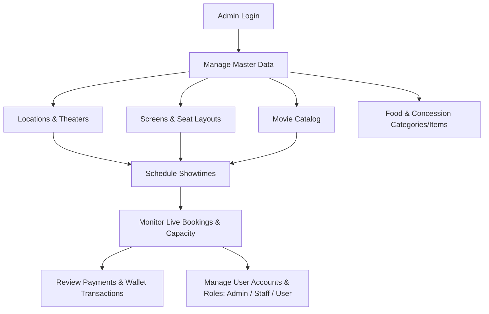

# Cinema Booking System — Workflows & Architecture

This document describes the operational workflows for Customers, Staff, and Administrators, including sequence diagrams.

---

## 1. Customer Booking Workflow

---

## 2. Customer Detailed Steps

1. **Authentication & Rate Limiting:**
   - User registers via `/api/auth/register` or logs in via `/api/auth/login` (rate-limited to 10 req/min per IP).
   - Client stores the returned JWT token and attaches it as `Authorization: Bearer <token>` on subsequent requests.
2. **Movie & Showtime Selection:**
   - Query active movies (`/api/movies`).
   - Find scheduled shows by theater, screen, and time (`/api/shows`).
3. **Seat Selection:**
   - Fetch screen details (`/api/screens/{id}`) and seat map (`/api/seats`).
   - Verify available seats for the designated show.
4. **Booking & Seat Lock:**
   - Submit booking request (`/api/bookings`) with customer and show IDs.
   - Associate reserved seats (`/api/booking-seats`).
5. **Concessions & Orders (Optional):**
   - Browse snack/drink categories (`/api/categories`, `/api/products`).
   - Place food order (`/api/orders`, `/api/order-items`).
6. **Payment Processing:**
   - Execute payment through wallet balance (`/api/wallets`, `/api/wallet-transactions`) or direct payment record (`/api/payments`).
   - Booking status updates to `CONFIRMED`.
7. **Ticket Issuance & QR Verification:**
   - Customer receives unique `booking_code` representing their electronic ticket.

---

## 3. Cinema Staff Workflow (`ROLE_STAFF`)

---

## 4. Administrator Workflow (`ROLE_ADMIN`)

### Admin Responsibilities:
1. **Infrastructure Setup:** Create Locations &rarr; Add Theaters &rarr; Configure Screens &rarr; Generate Seats.
2. **Catalog Management:** Add Movies and Concession Categories/Products.
3. **Show Scheduling:** Assign Movie + Screen + Start Time into a Show.
4. **User & Security Management:** Manage user accounts, role allocations (`ADMIN`, `STAFF`, `USER`), and audit system security.
5. **Monitoring & Auditing:** View all customer bookings, orders, and payment records.
